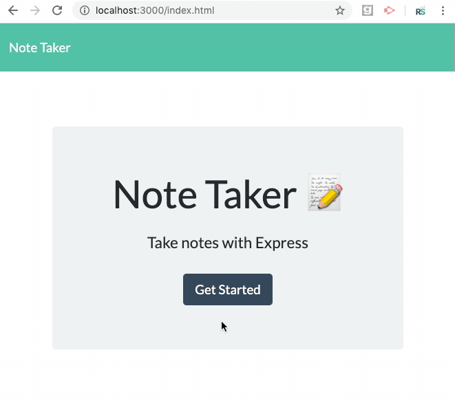

  # Note Taker Homework

  ## Description
  This app can be used to write, save, and delete notes.

  ## Table of Contents
  * [Installation](#installation)
  * [Usage](#usage)
  * [License](#license)
  * [Contributing](#contributing)
  * [Tests](#tests)
  * [Questions](#questions)
  
  
  ## Installation
  Clone the repo, open it, and enter 'npm i' in the CLI.
  
  
  ## Usage
  Run the app by typing 'node server.js' into the Terminal, then go to http://localhost:3000.index.html in a browser to try out the functionality. The application  saves user input to a JSON file, then reads the contents of that file and displays them back to the user.

  

  
  ## License
  
      
  
  ## Contributing
  We take all forms of contributions but prefer Bitcoin. Kidding! 

  
  ## Tests
  Try to break this thing and let me know what you find :)

  
  ## Questions?
  Please feel free to reach out to me with any questions.

  GitHub Profile: <a href='https://github.com/vertjames'>vertjames</a>  
    
  _ _ _